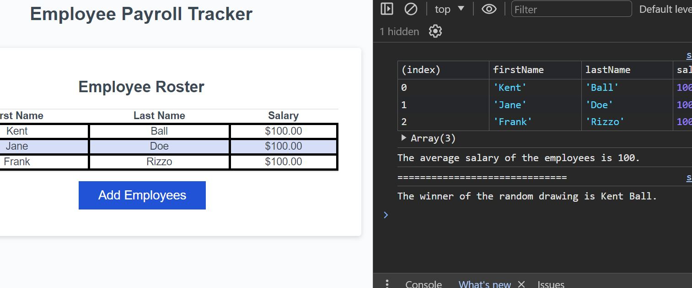

# Payroll-tracker

## Description
This program functions as an employee payroll tracker by providing several window prompts which ask the user to input the employee names and salary. We were provided starter code for this assignment, which consisted of the displayEmployees() and trackEmployeeData() functions, as well as the code on lines 2 and 136. The collectEmployees(), displayAverageSalary() and getRandomEmployee() functions were written by me. I received assistance from TA Gerard Mennella on debugging the code I orignally had in line 29, which was not correct syntactically for pushing objects to an array. Before getting help, I tried debugging the code myself by checking the error details in the console. 

## Usage
This program is designed to run in the browser and no installation is necessary. 

